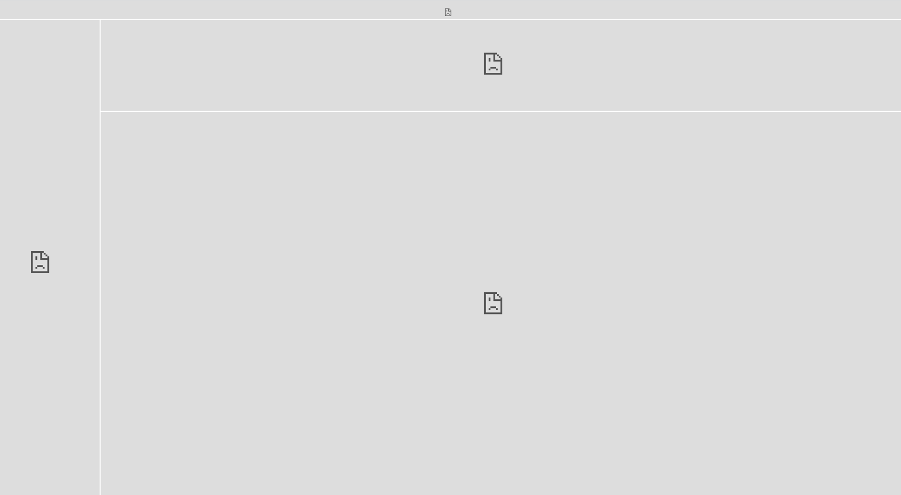

# 의존성

```
spring-cloud-starter-netflix-eureka-client
h2
spring-boot-starter-security
```

# 설정

- UserServiceApplication
    - @EnableDiscoveryClient 설정 필요
  ```java
  @SpringBootApplication
  @EnableDiscoveryClient // @EnableEurekaClient 로 해도 됨
  public class UserServiceApplication {
      // ...
  }
  ```

- application.yml
    ```yaml
    spring:
      application:
        name: user-service
    
    eureka:
      instance:
        instance-id: ${spring.application.name}:${spring.application.instance_id:${random.value}}
      client:
        register-with-eureka: true # Eureka 서버에 등록
        fetch-registry: true  # Eureka 서버로부터 인스턴스 정보를 주기적으로 가져올 것인지 설정
        service-url:
          defaultZone: http://127.0.0.1:8761/eureka # Eureka 서버 위치
    ``` 
    - instance-id: ${spring.cloud.client.hostname}:${spring.application.instance_id:${random.value}}
        - `${spring.application.instance_id:${random.value}}` = spring.application.instance_id 를 ${random.value} 로 하겠다는
          의미.

- h2
    - version = 1.3.176 이 후 부터 보안 이슈로 DB 자동생성을 막아둠. 1.3.176 사용 권장

```
접속 : http://{service-url}/h2-console

JDBC URL : jdbc:h2:mem:testdb
```

# 메이븐 통한 Port 변경 실행 방법

```bash
$ mvn spring-boot:run -Dspring-boot.run.jvmArguments='-Dserver.port=9003'
```

- eureka.instance.instance-id: ${spring.cloud.client.hostname}:${spring.application.instance_id:${random.value}}

# Trouble Shooting

- H2 콘솔 버그
    - 현상 : 아래와 같이 콘솔 화면이 나타나지 않음
        - 
    - 원인 : Spring Security 적용으로 인한 frame 막힘 현상
    - 해결방법
        - WebSecurity.java > `http.headers().frameOptions().disable();` 추가